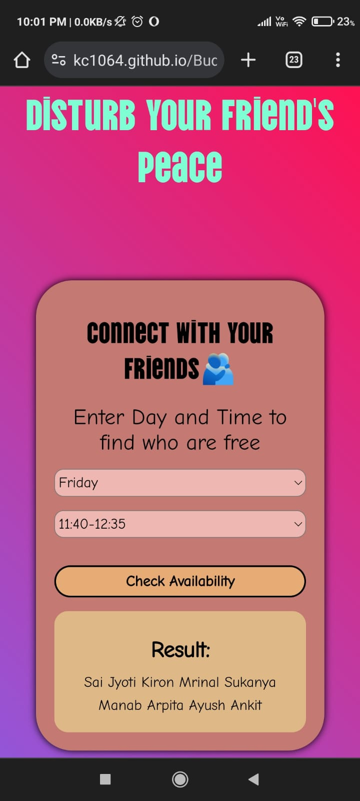

<h1 align="center">Buddy Project</h1>

<h3 align="center">Live Demo</h3>

Check out the live demo <a href="https://kc1064.github.io/Buddy-Project/">here</a>.

<h2 align="center">Mobile View</h2>

<h2 align="center">Desktop View</h2>

<h3 align="center">Tech Stack</h3>

  <strong>HTML</strong> | <strong>CSS</strong> | <strong>JavaScript</strong>

<h3 align="center">Why I Made This</h3>

  The idea for this project sprouted spontaneously during our 2nd-year classes, a moment of inspiration that turned into a collaborative effort. What began as a casual discussion soon transformed into a tangible project aimed at simplifying the coordination of schedules among friends.

<h3 align="center">Future Enhancements</h3>

  As we delved into the project, we realized the potential for making it more dynamic and user-friendly. What began as a spontaneous creation during our academic pursuits turned into an opportunity to enhance our development skills and address a real-world problem.

<h3 align="center">Usage</h3>

  1. Clone the repository. 
  2. Open `index.html` in your preferred web browser. 
  3. Register or log in to start using the application.

<h3 align="center">Future Enhancements</h3>

  <strong>Real-Time Updates</strong>: Implement real-time updates to reflect changes in friend availability instantly. 
  <strong>Mobile Responsiveness</strong>: Make the application responsive to different screen sizes for a seamless user experience on various devices.

